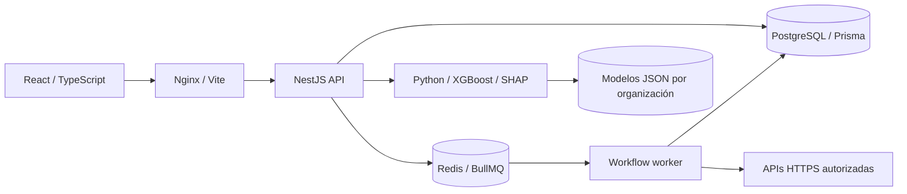

# NexusFlow AI

Plataforma de automatización empresarial, analítica comercial e inteligencia predictiva. Convierte transacciones en segmentos de clientes, estimaciones de abandono y acciones auditables mediante workflows visuales.

Esta versión implementa los seis módulos en una aplicación integrada y ejecutable. Está orientada a validación funcional y desarrollo; un despliegue comercial requiere configurar TLS, respaldos, observabilidad y validar los modelos con datos del negocio. Ningún sistema puede garantizar ser «inhackeable».

## Arranque rápido

Requisitos: Node.js 24 LTS, npm y Docker con Compose. Python local es opcional: la IA corre en un contenedor.

```bash
npm ci
npm run setup
docker compose up --build -d
```

Abre **http://localhost:8088** y crea tu organización. No hay cuentas ni contraseñas predeterminadas. Selecciona USD, CLP o EUR como moneda de los datos: la plataforma rechaza archivos con otras monedas para evitar sumas financieras incorrectas.

`setup` genera secretos criptográficos aleatorios, sustituye valores de ejemplo y conserva credenciales personalizadas. Los archivos `.env` quedan fuera de Git y de las imágenes. Si ya existía `apps/api/.env`, sus conexiones se conservan; el stack Docker utiliza el `.env` de la raíz y su propia base de datos.

La primera construcción descarga dependencias de Node y Python y puede tardar varios minutos. Las migraciones se aplican mediante un servicio separado antes de iniciar la API. Solo la web publica un puerto, vinculado a `127.0.0.1`; PostgreSQL, Redis, API y ML permanecen en la red interna.

```bash
docker compose ps
docker compose logs --tail 100 api ml
docker compose stop
docker compose start
```

Los volúmenes preservan base de datos, cola y modelos entre reinicios. No uses `docker compose down -v` si deseas conservar esos datos.

## Qué incluye

| Módulo                  | Funciones disponibles                                                                                                                                                                                                 |
| ----------------------- | --------------------------------------------------------------------------------------------------------------------------------------------------------------------------------------------------------------------- |
| Flow Engine             | Editor React Flow, disparadores manuales/webhook/cron/churn/retrasos, condiciones con ramas, transformaciones por plantillas, alertas, tareas, reportes y llamadas HTTPS. Versionado, snapshots e historial por paso. |
| Customer Intelligence   | Clientes con búsqueda y paginación, transacciones recientes, segmentos RFM, ingresos, ticket promedio, recurrencia y evolución mensual.                                                                               |
| Predictive AI           | Entrenamiento XGBoost por organización, evaluación en clientes separados, línea base, precision/recall/F1/PR-AUC, explicaciones SHAP y política de retención configurable.                                            |
| AutoOps                 | Importación CSV, validación previa, detección de duplicados/inconsistencias, importación transaccional e informes consolidados. Integraciones con credenciales cifradas.                                              |
| Operations Intelligence | Simulación reproducible de pedidos, KPIs por transportista, detección de retrasos y conexión con alertas/workflows. Los pedidos de demostración se identifican con SIM.                                               |
| Security Center         | Roles, usuarios, desactivación/revocación inmediata, auditoría HMAC encadenada y simulaciones educativas con autorización registrada y métricas agregadas.                                                            |

Incluye bandeja de tareas/alertas, cambio de contraseña, interfaz adaptable a móviles, carga por rutas y manejo explícito de errores. Los datos que muestra la interfaz provienen de la API; los estados vacíos no se rellenan con métricas ficticias.

## Prueba la plataforma

Genera un archivo sintético con 200 clientes y 700 transacciones:

```bash
npm run demo:csv
# O selecciona moneda y destino:
node scripts/demo-csv.mjs demo-transacciones.csv CLP
```

1. En **AutoOps**, selecciona el CSV y pulsa **Validar archivo**. Revisa errores y luego **Importar datos**.
2. Consulta el dashboard y **Customer Intelligence → Segmentación RFM**.
3. En **Flow Engine**, crea un workflow. El ejemplo inicial conecta un disparador manual con una alerta. Guarda, ejecuta y revisa **Ejecuciones** y **Alertas y tareas**.
4. En **Predictive AI**, entrena el modelo y evalúa clientes. El CSV demo incluye historial suficiente para ilustrar ambas clases; sus resultados no miden utilidad comercial real.
5. Configura una política de retención y un workflow de abandono. Las acciones solo se activan con un modelo entrenado y se evita repetir tareas/alertas abiertas para el mismo cliente.
6. En **Operations Intelligence**, simula pedidos y detecta retrasos. Un workflow con el disparador de pedido atrasado recibe esos eventos.
7. En **Security Center**, revisa permisos y verifica la cadena de auditoría.

También existe un seed opcional para una base de desarrollo vacía. Requiere `SEED_EMAIL` y `SEED_PASSWORD` definidos por el operador; cancela si la cuenta ya existe y está bloqueado en producción. Ejecuta `npm run seed -w @nexusflow/api` desde un entorno con conexión a la base. No crea campañas ni envía comunicaciones.

## Desarrollo local

```bash
npm ci
npm run setup
docker compose -f compose.yaml -f compose.dev.yaml up -d postgres redis ml
npm run prisma:migrate -w @nexusflow/api
```

En terminales separadas:

```bash
npm run dev:api
npm run dev:web
```

Web: http://localhost:5173. API: http://localhost:3001/api. Vite reenvía `/api` al backend y mantiene el navegador en un único origen. El archivo generado configura PostgreSQL en `localhost:54330`, Redis en `localhost:63800` y ML en `localhost:8001`. Si ya tenías un `.env`, comprueba sus conexiones antes de migrar. El proyecto no modifica contenedores de otras aplicaciones.

La IA puede ejecutarse fuera de Docker con Python 3.12, un entorno virtual, `pip install -r services/ml/requirements.txt` y `uvicorn main:app --port 8001` desde `services/ml`, definiendo previamente `ML_SERVICE_TOKEN`. En equipos con controles corporativos que bloqueen DLLs de Pandas, usa Docker.

## Arquitectura



```text
apps/api/       API, autenticación, permisos, workflows, importación y módulos de negocio
apps/web/       React, editor visual, dashboard y administración
services/ml/    Extracción histórica, entrenamiento, evaluación, scoring y SHAP
scripts/       Preparación de entorno, CSV demo y pruebas integradas
docs/          Arquitectura, seguridad, API y operación
```

El `orgId` se obtiene de la sesión, nunca del cuerpo enviado por el navegador. Los endpoints acotan sus consultas por organización y los permisos se verifican en el servidor. El servicio ML exige un token interno y almacena modelos en directorios derivados del hash de la organización.

## Datos de entrada

```csv
customer_id,customer_name,email,transaction_id,amount,currency,date
C001,Ana,ana@example.com,T001,125.50,USD,2026-01-31
C001,Ana,ana@example.com,T002,80.00,USD,2026-02-15
```

Obligatorios: `customer_id`, `transaction_id`, `amount`, `date`. Opcionales: nombre, email, moneda; si falta moneda, se usa USD. Se admiten alias como `cliente_id`, `nombre`, `transaccion_id`, `monto`, `moneda` y `fecha`. Los importes deben ser positivos y las fechas no deben ser futuras. El formato recomendado es importe decimal con punto y fecha ISO 8601. Los valores con coma decimal deben ir entre comillas para conservar el CSV.

Límites: 5 MB, 50.000 filas y 10.000 caracteres por registro. Los errores detallados se acotan a 100 filas y las inconsistencias a 50. Se rechazan cabeceras ambiguas, datos binarios y archivos mal formados. La reimportación omite los IDs de transacción ya existentes dentro de la organización. Las filas válidas se importan juntas en una transacción; las inválidas se registran como rechazadas. Los IDs existentes no actualizan importes ni nombres: una corrección de datos necesita un proceso explícito de reconciliación.

## Workflows e integraciones

Un flujo admite un solo disparador, máximo 50 nodos y 100 conexiones, sin ciclos ni nodos desconectados. Las condiciones tienen salidas `true`/`false`. Las plantillas leen rutas como `{{trigger.customerId}}` y `{{data.nombre}}`; no ejecutan JavaScript ni acceden al entorno del proceso.

Cron usa cinco campos y **UTC**. Una ejecución manual puede probar borradores; los eventos y la programación solo disparan workflows activos. Cada ejecución guarda una copia del grafo. La cola tiene concurrencia 5 y reintentos de infraestructura con backoff; cada acción puede configurar hasta 3 reintentos. Los fallos de negocio se registran como fallidos.

Un reconciliador recupera ejecuciones encoladas que no llegaron a Redis. Las corridas interrumpidas durante más de cinco minutos quedan fallidas para revisar sus efectos antes de repetirlas. Las acciones externas no ofrecen garantía de «exactamente una vez»: utiliza claves de idempotencia en el servicio destino. La cuota actual es 200 corridas activas por organización.

Las acciones HTTP están deshabilitadas hasta configurar `HTTP_ACTION_ALLOWLIST` con dominios exactos. Se permite HTTPS en 443/8443, se bloquean destinos privados y se valida DNS al conectar. No se siguen redirecciones. Las credenciales se guardan en **Integraciones** con AES-256-GCM; el nodo las referencia mediante `integrationId`. Solo se envían al mismo origen configurado, y las respuestas autenticadas no se guardan como previews para evitar reflejar secretos. No pongas credenciales en URLs, payloads o plantillas.

Los webhooks exigen `X-Nexus-Timestamp` en segundos y `X-Nexus-Signature`:

```text
sha256=HMAC_SHA256(secreto, timestamp + "." + cuerpo_JSON_exacto)
```

Se acepta una ventana de cinco minutos y se rechazan repeticiones; una clave única persistida impide duplicar la misma firma después de reiniciar. El secreto solo se muestra al crear o rotar y queda cifrado en la base. [Contrato y ejemplo de firma](docs/API.md).

## Modelo predictivo

Las features son recencia, frecuencia y valor monetario calculados con transacciones anteriores al corte. El corte se sitúa 90 días antes del momento de entrenamiento. La etiqueta vale 1 si no hay compra en los 90 días posteriores, observados en el histórico. Esta definición mide inactividad comercial; no demuestra cancelación ni cubre todos los negocios.

Se necesitan al menos 180 días de historial, 80 clientes y 20 ejemplos por clase. Se reservan 25% de los clientes para evaluación, sin compartir clientes entre entrenamiento y validación. El modelo se compara con `DummyClassifier(strategy="prior")` y solo se promueve si su PR-AUC supera esa línea base. La selección no se ajusta sobre el conjunto de evaluación; el umbral de evaluación es 0,5.

Las explicaciones SHAP se expresan en log-odds y son contribuciones al modelo, no causalidad. Los modelos usan el formato JSON nativo de XGBoost: no se cargan objetos pickle suministrados por usuarios. El manifiesto se reemplaza de forma atómica y los modelos se separan por organización.

Si todavía no existe un modelo, se devuelve un **indicador heurístico de recencia**, etiquetado explícitamente; no es una probabilidad calibrada y no activa políticas automáticas. Antes de usar predicciones comercialmente, evalúa calibración, drift, ventanas temporales adicionales, sesgo y costos de falsos positivos/negativos. [Detalles y decisiones](docs/ARCHITECTURE.md).

## Seguridad y operación

Controles implementados: scrypt con sal aleatoria, access tokens de 15 minutos mantenidos solo en memoria del navegador, refresh tokens opacos de 7 días almacenados como hash, rotación y detección de reutilización, cookies HttpOnly/SameSite Strict/Secure en producción, revocación de familias, verificación de sesión y usuario en cada petición, bloqueo tras intentos fallidos, rate limiting, Zod, CORS explícito, protección de origen en endpoints con cookies y cabeceras de seguridad.

La auditoría HMAC encadena entradas y serializa su escritura con locks de PostgreSQL. Detecta modificaciones y huecos internos; no puede detectar por sí sola la eliminación del final de una cadena. Para ello debes conservar checkpoints firmados fuera de la base. Los logs HTTP excluyen cuerpos, cabeceras, consultas y secretos de webhook.

Las campañas educativas exigen una referencia de autorización y destinatarios de la organización. Los enlaces se muestran una vez, caducan a los 30 días y se entregan manualmente. La landing se identifica como simulación, no solicita credenciales y registra participación/reporte idempotentes. No hay envío de correos ni suplantación automática.

El stack por defecto es de desarrollo local. Para producción define `CORS_ORIGINS=https://tu-dominio`, coloca un proxy con TLS frente a la web y usa:

```bash
docker compose -f compose.yaml -f compose.production.yaml up --build -d
```

La variante requiere secretos fuertes, HTTPS y Redis, y deshabilita el registro público. Crea el primer OWNER mediante un registro controlado antes de cerrar el registro. No expongas puertos internos ni uses el seed de demo en producción. Conserva `DATA_ENCRYPTION_KEY` y `AUDIT_HMAC_KEY` junto con los respaldos: cambiarlos sin migración vuelve ilegibles secretos o invalida firmas históricas. [Modelo de amenazas](docs/SECURITY.md) · [Operación y recuperación](docs/OPERATIONS.md).

## Verificación

```bash
npm run lint
npm test
npm run build
npm run audit:prod
npm run format:check
docker compose exec -T ml python -m pytest -q -p no:cacheprovider
npm run test:smoke
npm run test:smoke:ml
npx playwright install chromium
npm run test:e2e -w @nexusflow/web
```

Las pruebas HTTP y de navegador requieren el stack activo y crean organizaciones de prueba aisladas con nombres Smoke/ML Smoke/Browser Test. Úsalas en desarrollo o CI, no sobre cuentas de clientes. La prueba de IA genera datos sintéticos para verificar el circuito completo, sin atribuirle rendimiento real de negocio.

GitHub Actions ejecuta tipos, tests, build, auditoría de dependencias y pruebas integradas. Las dependencias de Node se fijan mediante `package-lock.json`; se aplica un override de `deepmerge-ts` 8.0.2 para corregir [GHSA-ggr8-5vv4-36mx](https://github.com/advisories/GHSA-ggr8-5vv4-36mx) en la cadena de Prisma. La compatibilidad se comprueba generando el cliente y aplicando migraciones. [Resultados locales](docs/VALIDATION.md).

## Alcance y siguientes versiones

La primera versión permite demostrar el ciclo completo: importar → analizar → predecir → actuar → auditar. No incluye cobros/suscripciones reales, conectores comerciales específicos, importación XLSX, automatización de navegador, telemetría logística real, envío de emails ni MFA/recuperación de contraseña. Esas capacidades requieren configuración y validación propias; no se simulan como funcionalidades terminadas.

Para ampliar hacia un SaaS comercial: identidad con MFA/verificación/recuperación, límites contractuales por plan, facturación, retención y borrado de datos, exportación de auditoría externa, rate limiting distribuido, aislamiento adicional en la base, métricas operativas, tareas ML asíncronas, modelos temporales/calibrados y pruebas de carga. La analítica logística de esta versión consulta hasta los 20.000 pedidos más recientes y debe pasar a agregados SQL/materializados antes de operar con mayor volumen.

Licencia MIT. Ver [LICENSE](LICENSE).
